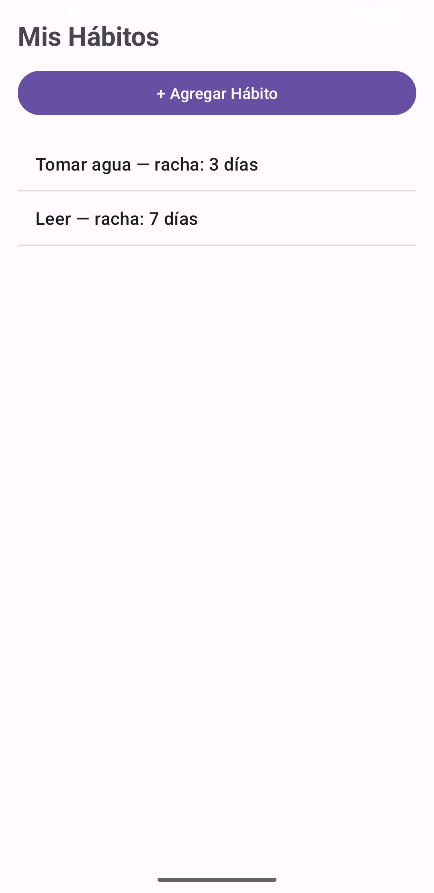
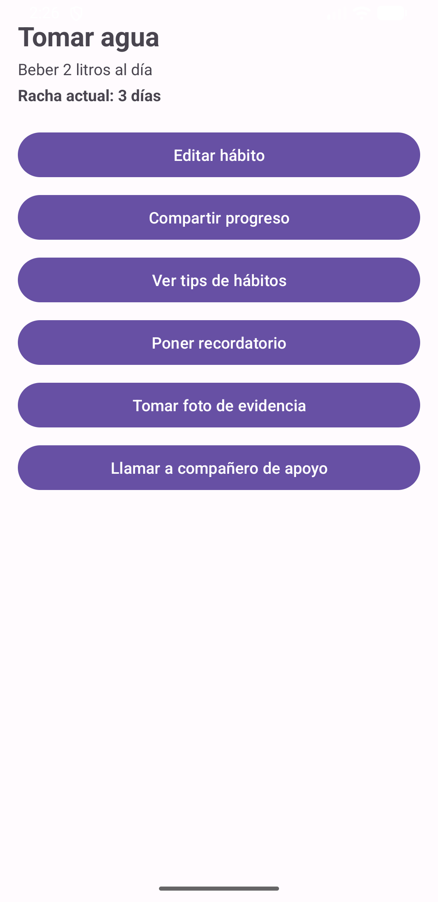
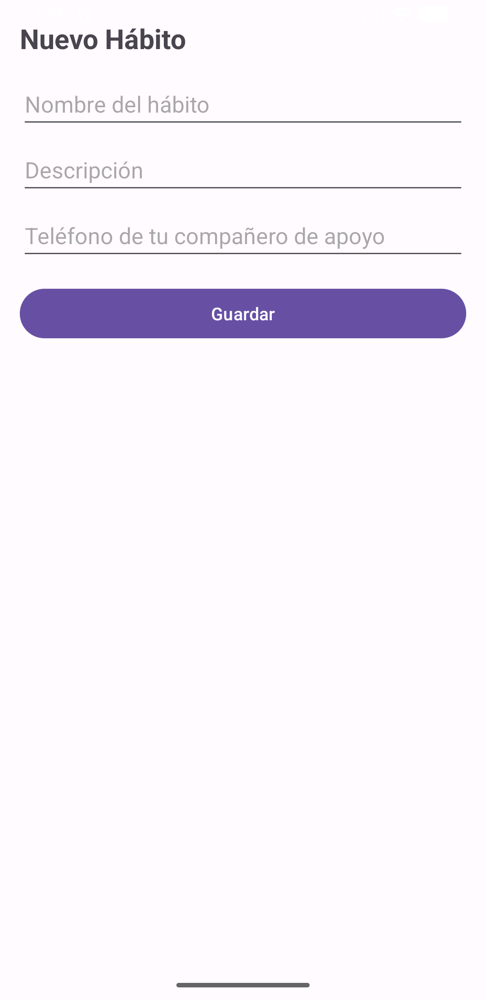
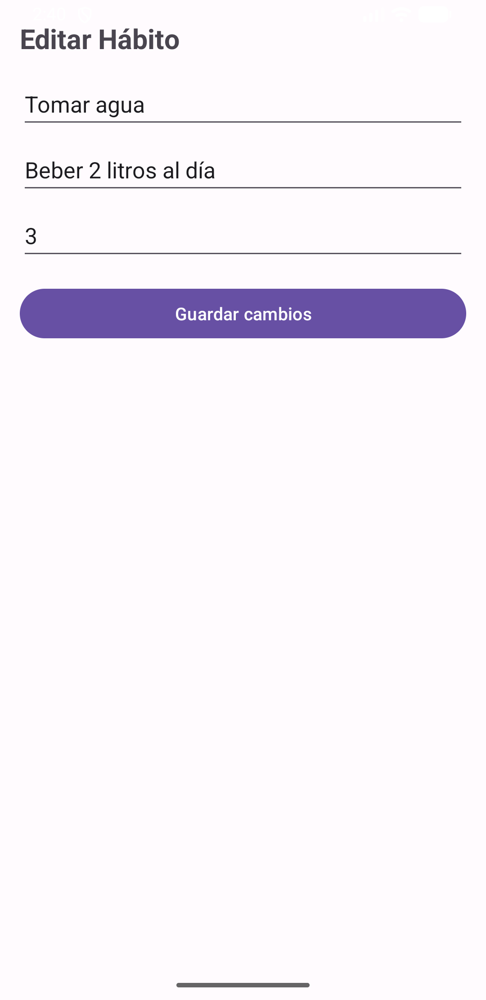

# 📱 Prototipo 2 – App de Hábitos

Aplicación Android desarrollada para la prueba **Prototipo 2** de Programación Android (IPST). Permite crear y gestionar hábitos personales, usando intents explícitos e implícitos para conectar pantallas y funcionalidades del sistema. 🚀

## ⚙️ Resumen técnico

- **Lenguaje:** Java
- **IDE:** Android Studio
- **Android Gradle Plugin (AGP):** 9.0.1
- **compileSdk / minSdk:** 36 / 26

## ✨ Funcionalidades

- ➕ Crear hábitos nuevos (nombre, descripción, teléfono de contacto)
- 📋 Ver detalle de cada hábito con su racha de días
- ✏️ Editar hábitos existentes
- 📤 Compartir progreso por cualquier app instalada
- 💡 Ver tips de hábitos en el navegador
- ⏰ Poner recordatorio diario
- 📸 Tomar foto como evidencia
- 📞 Llamar a un compañero de apoyo

## 🔗 Intents implementados (8 total)

### Explícitos (3)

| # | Intent | Descripción | Pasos para probar |
|---|---|---|---|
| 1 | MainActivity → AddHabitActivity | Abre el formulario para crear un hábito | Tocar "+ Agregar Hábito" en la pantalla principal |
| 2 | MainActivity → HabitDetailActivity | Abre el detalle de un hábito seleccionado | Tocar cualquier hábito de la lista |
| 3 | HabitDetailActivity → EditHabitActivity | Abre el formulario de edición | Dentro del detalle, tocar "Editar hábito" |

### Implícitos (5)

| # | Intent | Acción del sistema | Pasos para probar |
|---|---|---|---|
| 4 | 📤 Compartir progreso | `ACTION_SEND` | En el detalle, tocar "Compartir progreso" → elegir una app |
| 5 | 🌐 Ver tips de hábitos | `ACTION_VIEW` (navegador) | En el detalle, tocar "Ver tips de hábitos" |
| 6 | ⏰ Poner recordatorio | `AlarmClock.ACTION_SET_ALARM` | En el detalle, tocar "Poner recordatorio" |
| 7 | 📸 Tomar foto de evidencia | `MediaStore.ACTION_IMAGE_CAPTURE` | En el detalle, tocar "Tomar foto de evidencia" |
| 8 | 📞 Llamar a compañero | `ACTION_DIAL` | En el detalle, tocar "Llamar a compañero de apoyo" |

## 🖼️ Capturas de pantalla

| Lista de hábitos | Detalle del hábito | Agregar hábito | Editar hábito |
|---|---|---|---|
|  |  |  |  |

## 📦 APK

El APK de debug se genera en `app/build/outputs/apk/debug/app-debug.apk` después de compilar el proyecto (`Build > Build Bundle(s) / APK(s) > Build APK(s)` en Android Studio).

## 👤 Autor

Juan Pablo (StaticDreamx64) — Ingeniería en Informática, IPST 🎓